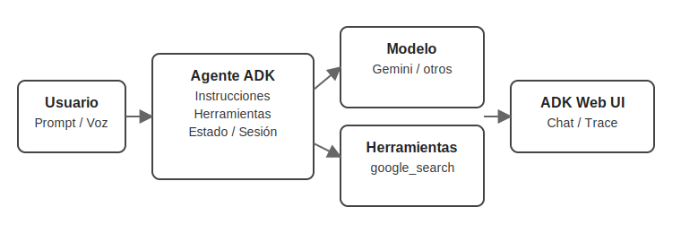

# 🤖 Lección 1: Construye tu primer agente con Google ADK

Resumen: Crea tu primer agente ADK con búsqueda web, configura el entorno (.env), prueba en la Web UI y sienta bases para futuras extensiones.

Notebook de la lección: https://github.com/seagomezar/ADK-Blog-Posts/blob/main/Lesson_1.ipynb

Bienvenida/o a la aventura de crear tu primer agente de noticias de IA con el Agent Developer Kit (ADK) de Google. En esta lección sentamos las bases de un agente capaz de conversar, conectarse al mundo real y entregar información fresca. Aquí tienes un recorrido claro del cuaderno `Lesson_1.ipynb`, con consejos prácticos para avanzar con confianza. 🙌

## Panorama general
- Anatomía de un agente: modelo + instrucciones + herramientas.
- Preparar el entorno y conocer la Web UI de ADK.
- Añadir búsqueda en tiempo real y probar modelos Gemini.
- Configurar agentes con Python o YAML.
- Afinar instrucciones para un comportamiento consistente.



## 1.1 Preparativos iniciales 🧰
ADK incluye las librerías esenciales (`google-adk`, utilidades CLI, helpers). Aun así, verifica dependencias y aísla tu entorno con un virtualenv. Si vas a extender la demo, agrega un `requirements.txt` propio para fijar versiones y evitar sorpresas.

## 1.2 Estructura base de un proyecto ADK 🏗️
Genera el esqueleto con (proyecto basado en código):

```bash
adk create app_01 --model gemini-2.0-flash-live-001 --api_key $GOOGLE_API_KEY
```

- `app_01/agent.py`: lógica del agente.
- `.env`: credenciales y configuración.
- `__init__.py`: importaciones limpias.

### Autenticación sin dolor 🔐
Puedes usar una API key de Gemini (Google AI Studio) o credenciales de Vertex AI.
- Google AI Studio (.env en `app_01/`):
  - `GOOGLE_GENAI_USE_VERTEXAI=FALSE`
  - `GOOGLE_API_KEY=<tu_api_key>`
- Vertex AI (.env o variables de entorno):
  - `GOOGLE_GENAI_USE_VERTEXAI=TRUE`
  - `GOOGLE_CLOUD_PROJECT=<proyecto>` y `GOOGLE_CLOUD_LOCATION=<ubicación>`
No publiques tus claves.

## 1.3 Escribiendo el primer `agent.py` ✍️
Con el cell magic `%%writefile` escribes desde el notebook. El agente mínimo define:

- Nombre legible (`ai_news_agent`).
- Modelo base (Gemini 2.0 Flash Live para voz).
- Instrucciones breves que describen su rol.

💡 Tip: ADK es agnóstico al modelo; puedes usar Gemini, Claude, Ollama o integraciones vía LiteLLM. Define pronto si priorizas voz, multimodalidad o latencia.

## 1.4 Probando en ADK Web UI 🌐
Para conversar con el agente, tienes dos opciones:

- Desde la carpeta padre del agente: `adk web` y luego selecciona "app_01" en el menú.
- O apuntando directo: `adk web --port 8000 app_01`

Abre la URL (http://localhost:8000). En Windows, si ves `_make_subprocess_transport NotImplementedError`, usa `adk web --no-reload`. Detén con `Ctrl-C`.

La Web UI muestra el trace (paso a paso) y permite interacción por voz en tiempo real. Para voz, usa modelos con Gemini Live API (por ejemplo, `gemini-2.0-flash-live-001`).

## 1.5 Añadiendo la herramienta de búsqueda 🔍
El modelo por sí solo no conoce noticias recientes. Agrega `google_search`:

```python
from google.adk.agents import Agent
from google.adk.tools import google_search

root_agent = Agent(
    name="ai_news_agent_simple",
    model="gemini-2.0-flash-live-001",
    instruction="Eres un asistente de noticias de IA. Usa Google Search para hallar información reciente.",
    tools=[google_search],
)
```

Con esto el agente consulta la web, procesa resultados y cita fuentes actuales. Ten en cuenta:
- `google_search` es compatible solo con modelos Gemini 2.
- Si la respuesta incluye "Search suggestions", debes mostrarlas en tu app (requisito de la política de Grounding con Google Search). Ver adk-docs: `docs/tools/built-in-tools.md` y `docs/grounding/google_search_grounding.md`.
Explora otras herramientas (código, bases de datos, Workspace) según tu caso.

## 1.6 Probando modelos de texto ⚡
`gemini-2.5-flash` prioriza texto y suele responder más rápido si no requieres audio. Puedes crear otra app con el mismo código y cambiar solo el modelo. Experimenta para balancear costo, latencia y capacidades.

## 1.7 Configuración declarativa con YAML 🧾
Si prefieres no escribir Python, usa `--type=config` para generar `root_agent.yaml` con los mismos campos (nombre, modelo, instrucciones, herramientas):

```yaml
name: ai_news_agent_yaml
model: gemini-2.0-flash-live-001
description: Agente que resume noticias recientes de IA.
instruction: Usa Google Search para encontrar y resumir novedades de IA.
tools:
  - name: google_search
```

📌 Sugerencia: Documenta decisiones en comentarios. ADK valida el esquema y avisará si falta algún campo clave. Más detalles: https://google.github.io/adk-docs/agents/config/

## 1.8 Afinando instrucciones avanzadas 🛡️
Para un comportamiento consistente, agrega reglas claras:

- Identidad definida: el agente solo cubre noticias de IA.
- Mecanismo de rechazo: texto exacto para solicitudes fuera de alcance.
- Flujos obligatorios: uso de `google_search` y citas de fuentes.
- Controles de contexto: delimita qué se considera una pregunta válida.

Este patrón reduce al mínimo alucinaciones y mantiene el propósito. ✅


## Buenas prácticas y próximos pasos 🚦
- Cierra procesos viejos con `pkill -f "adk web"` para liberar recursos.
- Documenta cada variante (`app_01` a `app_05`) con notas y resultados.
- Repite prompts con pequeñas variaciones para observar cambios (la salida puede variar por estocasticidad).
- Define convenciones de nombres, carpetas y versionado desde ya.

## Recursos
- ADK Quickstart: https://google.github.io/adk-docs/get-started/quickstart/
- ADK Python: https://google.github.io/adk-docs/get-started/python/
- Built‑in Tools (Google Search): https://google.github.io/adk-docs/tools/built-in-tools/

—
Siguiente lección ➜ https://www.sebastian-gomez.com/category/inteligencia-artificial/adk-clase-2-potencia-tu-agente-con-herramientas-personalizadas

Descargo de responsabilidad: Este contenido se basa en el curso “Building Live Voice Agents with Google’s ADK!” de DeepLearning.AI (https://learn.deeplearning.ai/courses/building-live-voice-agents-with-googles-adk/lesson/dewdno61/introduction). Este blog busca acercar material de ADK al español.
