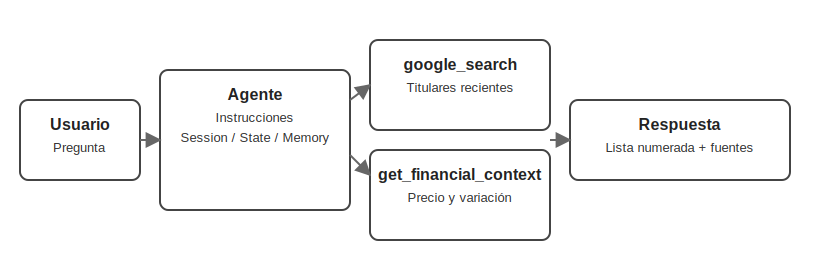

# 🛠️ Lección 2: Potencia tu agente con herramientas personalizadas

Resumen: Añade un Function Tool (`get_financial_context`), combínalo con `google_search`, guía la conversación con instrucciones y prueba el flujo en la Web UI.

En esta segunda entrega extendemos el agente con una herramienta propia y reforzamos el flujo conversacional para que las respuestas sean útiles y consistentes. Además, conectamos las ideas del video sobre Sesión, Estado y Memoria, que dan soporte a conversaciones persistentes. 🙌

## Panorama general
- Añadir dependencias como `yfinance` y repasar utilidades de ADK.
- Crear un proyecto `app03` y definir una herramienta propia (`get_financial_context`).
- Combinar herramientas: búsqueda web + datos financieros en un mismo agente.
- Redactar instrucciones que guían el diálogo paso a paso.
- Probar el agente en `adk web` e iterar rápido.



## 2.1 Preparativos iniciales 🔧
- Asegura `google-adk` y `yfinance` instalados si estás fuera del entorno del curso.
- Sobre credenciales: ADK lee `.env` cuando ejecutas `adk web`/`adk run` desde la carpeta adecuada. Usa `GOOGLE_API_KEY` (AI Studio) o variables Vertex AI. Si usas notebooks con `load_env()`, aclara que es un helper del curso y que en producción usarás `.env`.
- Tip: crea un entorno virtual por proyecto (`python -m venv .venv && source .venv/bin/activate`).

## 2.2 Configuración del proyecto 🚀
- Genera la app con scaffolding de ADK:
  ```bash
  adk create app03 --model gemini-2.0-flash-live-001 --api_key $GOOGLE_API_KEY
  ```
- Estructura:
  - `app03/agent.py`: lógica del agente.
  - `.env`: credenciales.
  - `__init__.py`: organización del paquete.

## 2.3 Construyendo un Function Tool a medida 💼
`get_financial_context` consulta Yahoo Finance vía `yfinance` para devolver precio y variación porcentual de cada ticker.

```python
from typing import Dict, List
import yfinance as yf

def get_financial_context(tickers: List[str]) -> Dict[str, str]:
    """Obtiene precio y variación diaria de cada ticker."""
    financial_data: Dict[str, str] = {}
    for ticker_symbol in tickers:
        try:
            stock = yf.Ticker(ticker_symbol)
            info = stock.info
            price = info.get("currentPrice") or info.get("regularMarketPrice")
            change_percent = info.get("regularMarketChangePercent")

            if price is not None and change_percent is not None:
                change_str = f"{change_percent * 100:+.2f}%"
                financial_data[ticker_symbol] = f"${price:.2f} ({change_str})"
            else:
                financial_data[ticker_symbol] = "Price data not available."
        except Exception:
            financial_data[ticker_symbol] = "Invalid Ticker or Data Error"
    return financial_data
```

### Claves del Financial Tool ✨
- Tipado explícito (`List[str]`, `Dict[str, str]`) → ADK genera el esquema automáticamente.
- Docstring descriptivo → el agente entiende cuándo usar la herramienta.
- Errores controlados → evita que un ticker inválido rompa la conversación.
- Formato consistente → devuelve un diccionario fácil de leer.

## 2.4 Instrucciones del agente principal 🧠
Integramos `google_search` y `get_financial_context` en un mismo `Agent` y usamos instrucciones para orquestar el flujo:

```python
root_agent = Agent(
    name="ai_news_chat_assistant",
    model="gemini-2.0-flash-live-001",
    instruction="""...""",
    tools=[google_search, get_financial_context],
)
```

- Claridad en el flujo: primero pide cuántas noticias quiere la persona.
- Uso forzado de herramientas: buscar titulares y luego enriquecer con datos de bolsa.
- Formato obligatorio: lista numerada citando herramientas y fuentes.
- Conversación guiada: tras responder, entrega el turno (“¿cuál te interesa?”).
- Reglas estrictas: solo IA y empresas listadas en EE.UU.; rechazos corteses si está fuera de alcance.

- ## 2.5 Pruebas y flujo conversacional 🔁
- Inicia la UI local:
  - Desde carpeta padre: `adk web --reload_agents` y selecciona "app03".
  - O directo: `adk web --port 8000 --reload_agents app03`
  - En Windows, si ves `_make_subprocess_transport NotImplementedError`, usa `--no-reload`. Detén con `Ctrl-C`.
- Guion sugerido:
  1) “Dame noticias de IA” → el agente pregunta cuántas notas quieres.
  2) “3” → devuelve tres titulares con contexto financiero.
  3) Elige una → amplía SOLO esa y vuelve a preguntar qué sigue.
- Induce errores (tickers desconocidos, preguntas fuera de tema) para verificar reglas. ⚠️

📌 Nota sobre Google Search:
- `google_search` funciona con modelos Gemini 2.
- Si el modelo devuelve "Search suggestions", muéstralas en tu UI (política de Grounding). Más info: https://google.github.io/adk-docs/tools/built-in-tools/

## 🎯 2.6 Desafíos propuestos
- Nuevo tool: conecta otra API (sentimiento, datos macro, papers). Sigue tipado + docstring + manejo de errores.
- Refina instrucciones: pide preferencia de cantidad, agrega disclaimers financieros, incluye timestamps.
- Ensaya diálogo: mezcla industrias y prueba ramificaciones.
- Simula fallos: datos faltantes o desconexiones con mensajes claros.

## 2.7 Recursos y referencias 📚
- Guía de Tools de ADK: https://google.github.io/adk-docs/tools/
- Function Tools: https://google.github.io/adk-docs/tools/function-tools/
- yfinance en PyPI: https://pypi.org/project/yfinance/


## Buenas prácticas y próximos pasos ✅
- Documenta variantes (`app03`, etc.) con fecha, prompts y resultados.
- Incluye pruebas manuales en PRs para evidenciar el flujo conversacional.
- Mantén claves fuera del repo y rota API keys periódicamente.
- Si evolucionas a podcast, evalúa memoria persistente para recordar preferencias.

—
Anterior lección ➜ https://www.sebastian-gomez.com/category/inteligencia-artificial/adk-clase-1-construye-tu-primer-agente-con-google-adk

Siguiente lección ➜ https://www.sebastian-gomez.com/category/inteligencia-artificial/adk-clase-3-construye-un-agente-investigador-en-segundo-plano

Descargo de responsabilidad: Este contenido se basa en el curso “Building Live Voice Agents with Google’s ADK!” de DeepLearning.AI (https://learn.deeplearning.ai/courses/building-live-voice-agents-with-googles-adk/lesson/dewdno61/introduction). Este blog busca acercar material de ADK al español.
