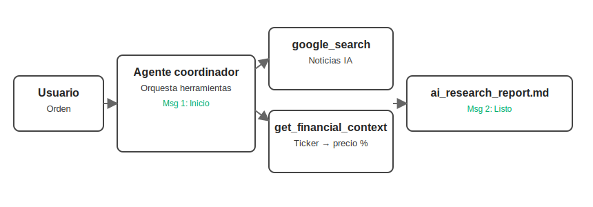

# 🧠 Lección 3: Construye un agente investigador en segundo plano

Resumen: Adopta el patrón Coordinator–Dispatcher para investigar en silencio, enriquecer con finanzas y persistir un reporte Markdown sin ruido en el chat.

Notebook de la lección: https://github.com/seagomezar/ADK-Blog-Posts/blob/main/Lesson_3.ipynb

En esta tercera lección transformamos al asistente conversacional en un coordinador silencioso que investiga, compone un reporte y solo te habla dos veces. Reutilizamos herramientas de la lección anterior y agregamos persistencia de archivo para obtener un artefacto claro: un reporte Markdown. 🚀

## Panorama general
- Reusar `get_financial_context` y sumar un tool para guardar Markdown.
- Implementar el patrón Coordinator–Dispatcher: ejecuta en segundo plano y responde dos veces.
- Forzar salidas estructuradas con una plantilla Markdown consistente.
- Probar la experiencia desde la ADK Web UI y visualizar el reporte.



## 3.1 Preparativos iniciales 🧰
- Asegura `google-adk>=1.12.0` y `yfinance` disponibles.
- Credenciales: ADK lee `.env` cuando corres `adk web`/`adk run`. Si usas `load_env()` en notebook, úsalo solo como helper y mantén `.env` como fuente en entornos reales.
- Trabaja en un entorno virtual para evitar conflictos entre lecciones.

## 3.2 Configuración del proyecto ⚙️
- Crea la app base:
  ```bash
  adk create app04 --model gemini-2.0-flash-live-001 --api_key $GOOGLE_API_KEY
  ```
- Estructura prevista:
  - `app04/agent.py` → implementación del agente coordinador.
  - `.env` → configuración sensible.
  - `__init__.py` → paquete Python.

## 3.3 Patrón Coordinator–Dispatcher 🤝
### El reto
- Un agente que “lee en voz alta” cada resultado genera ruido y carga cognitiva.

### La solución
- Separar la interacción en dos fases:
  1) Coordinación: reconoce la orden y avisa que empieza a trabajar.
  2) Ejecución silenciosa: busca, cruza datos y genera un reporte sin interrumpir.

## 3.4 Herramientas y persistencia 💾
- Reusamos `get_financial_context` para enriquecer titulares.
- Añadimos `save_news_to_markdown` para persistir el reporte:
  ```python
  def save_news_to_markdown(filename: str, content: str) -> str:
      """Guarda el reporte de investigación en un archivo Markdown."""
      output_path = pathlib.Path(filename)
      output_path.write_text(content, encoding="utf-8")
      return f"Report saved to {output_path.resolve()}"
  ```
Notas de estado y persistencia:
- Las modificaciones a `tool_context.state` durante la ejecución quedan registradas por el framework y se persisten vía el runner; no implican almacenamiento externo a menos que configures servicios de memoria/artefactos.
- La escritura de archivo en `save_news_to_markdown` genera el artefacto final de forma explícita.

## 3.5 Reportes estructurados 🗂️
Plantilla recomendada (incrustada en las instrucciones del agente):
- Título, fecha y contexto.
- Lista numerada de 5 noticias con: titular, compañía y ticker, métrica financiera (`get_financial_context`) y resumen breve.

## 3.6 Instrucciones avanzadas: agente coordinador 🧭
El agente cambia de “presentador” a “coordinador de investigación” con reglas estrictas:
- Dos mensajes máximo:
  1) Inicio: “Ok, empiezo la investigación; dame un momento…”.
  2) Cierre: “Listo, guardé el reporte en `ai_research_report.md`”.
- Trabajo en segundo plano entre ambos mensajes: `google_search` → extraer tickers → `get_financial_context` → formatear según plantilla → `save_news_to_markdown`.
- Sin resultados intermedios ni conversación adicional.

## 3.7 Pruebas en la Web UI 🧪
- Ejecuta la UI:
  - Desde carpeta padre: `adk web` y selecciona "app04".
  - O directo: `adk web --port 8000 app04`
  - En Windows, usa `--no-reload` si es necesario. Detén con `Ctrl-C`.
- Guion sugerido:
  1) “Consígueme las últimas noticias de IA”.
  2) El agente confirma el inicio y se queda en silencio.
  3) Mensaje final confirmando `ai_research_report.md`.
  4) Abre el archivo y valida formato y contenido.
- Cierra el proceso al terminar: `pkill -f "adk web"`. ⚠️

📌 Opcional (memoria de largo plazo):
- Para usar Vertex AI Memory Bank desde `adk web`/`adk api_server`, arranca con `--memory_service_uri=agentengine://<agent_engine_id>` según adk-docs `docs/sessions/memory.md`.

## 3.8 Visualización del reporte 📄
Desde el notebook:
```python
from IPython.display import Markdown, display
with open("ai_research_report.md", encoding="utf-8") as f:
    display(Markdown(f.read()))
```


## Buenas prácticas y próximos pasos ✅
- Versiona `ai_research_report.md` solo si necesitas auditar resultados; si no, ignóralo.
- Parametriza cantidad de noticias y formato del reporte si apuntas a pipelines (podcast, boletines).
- Para producción, evalúa almacenamiento externo (buckets, bases de datos).
- Practica el mismo patrón con otras temáticas para afinar prompts y plantillas.

—
Anterior lección ➜ https://www.sebastian-gomez.com/category/inteligencia-artificial/adk-clase-2-potencia-tu-agente-con-herramientas-personalizadas

Siguiente lección ➜ https://www.sebastian-gomez.com/category/inteligencia-artificial/adk-clase-4-callbacks-y-guardrails-para-agentes-confiables

Descargo de responsabilidad: Este contenido se basa en el curso “Building Live Voice Agents with Google’s ADK!” de DeepLearning.AI (https://learn.deeplearning.ai/courses/building-live-voice-agents-with-googles-adk/lesson/dewdno61/introduction). Este blog busca acercar material de ADK al español.
