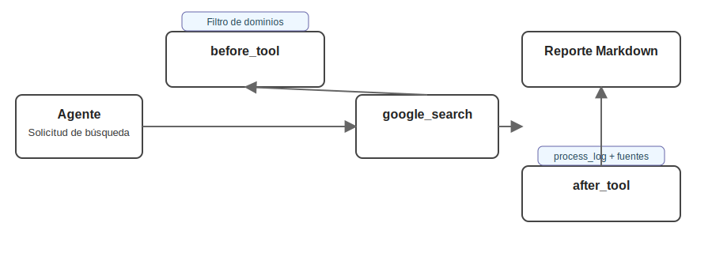

# 🧩 Lección 4: Callbacks y guardrails para agentes confiables

Resumen: Implementa filtros y trazabilidad con callbacks (`before_tool` y `after_tool`) en `LlmAgent`, y conoce cuándo usar Plugins para políticas globales.

Notebook de la lección: https://github.com/seagomezar/ADK-Blog-Posts/blob/main/Lesson_4.ipynb

Los agentes son potentes… y no deterministas. En esta lección añadimos control programático para que tu agente se comporte de forma predecible: afinamos instrucciones y usamos callbacks como guardrails que filtran dominios, enriquecen respuestas y dejan trazabilidad. Al final tendrás un agente listo para producción que combina todo lo previo con controles efectivos. 💪

## Panorama general
- Reutilizar tools previas: `get_financial_context` y `save_news_to_markdown`.
- Entender puntos de extensión: before/after agent, tool y model.
- Implementar dos callbacks: filtrado de fuentes (before tool) y enriquecimiento de respuesta (after tool).
- Actualizar instrucciones para que el agente sea “callback-aware”.
- Probar en `adk web`, validar logs de proceso y cerrar servicios.



## 4.1 Preparación del entorno 🔧
Usaremos el mismo modelo de voz para continuidad.

```bash
adk create app5 --model gemini-2.0-flash-live-001 --api_key $GOOGLE_API_KEY
```

Credenciales: define `.env` en `app5/` (AI Studio: `GOOGLE_API_KEY`; Vertex AI: `GOOGLE_GENAI_USE_VERTEXAI=TRUE`, `GOOGLE_CLOUD_PROJECT`, `GOOGLE_CLOUD_LOCATION`). Si usas `load_env()` en notebooks, trátalo como helper; en ejecución con `adk web`, ADK leerá `.env`.

## 4.2 Reutiliza herramientas de lecciones anteriores ♻️
Copiamos `get_financial_context` (Lección 2 y 3) y `save_news_to_markdown` (Lección 3) a `app5/agent.py`.

```python
def save_news_to_markdown(filename: str, content: str) -> Dict[str, str]:
    if not filename.endswith(".md"):
        filename += ".md"
    file_path = pathlib.Path.cwd() / filename
    file_path.write_text(content, encoding="utf-8")
    return {"status": "success", "message": f"Saved to {file_path.resolve()}"}
```

## 4.3 Callbacks en ADK 🧠
ADK ofrece hooks en varios puntos del ciclo de vida:
- `before_agent_callback` / `after_agent_callback`
- `before_tool_callback` / `after_tool_callback`
- `before_model_callback` / `after_model_callback`

### Callback 1: Filtrado de fuentes (Before Tool)
Bloquea búsquedas a dominios no deseados y responde con errores descriptivos.

```python
BLOCKED_DOMAINS = ["wikipedia.org", "reddit.com", "youtube.com", "medium.com", "investopedia.com", "quora.com"]

def filter_news_sources_callback(tool, args, tool_context):
    if tool.name == "google_search":
        query = args.get("query", "").lower()
        for domain in BLOCKED_DOMAINS:
            if f"site:{domain}" in query or domain.split(".")[0] in query:
                return {
                    "error": "blocked_source",
                    "reason": f"Searches targeting {domain} are not allowed. Use professional news sources.",
                }
    return None
```

### Callback 2: Enriquecimiento de respuesta (After Tool)
Extrae dominios de los resultados, mantiene un `process_log` en `tool_context.state` y lo inyecta en la salida.

```python
from google.adk.tools import ToolContext

def initialize_process_log(tool_context: ToolContext):
    if 'process_log' not in tool_context.state:
        tool_context.state['process_log'] = []

def inject_process_log_after_search(tool, args, tool_context, tool_response):
    if tool.name != "google_search":
        return tool_response

    # Normaliza respuesta (str o dict)
    if isinstance(tool_response, dict):
        raw = tool_response.get("search_results") or tool_response.get("results") or ""
    else:
        raw = tool_response

    if isinstance(raw, str) and raw:
        urls = re.findall(r'https?://[^\s/]+', raw)
        unique_domains = sorted(list({urlparse(url).netloc for url in urls}))
        if unique_domains:
            sourcing_log = f"Action: Sourced news from: {', '.join(unique_domains)}."
            tool_context.state['process_log'] = [sourcing_log] + tool_context.state.get('process_log', [])

    # Devuelve estructura enriquecida
    return {
        "search_results": raw if isinstance(raw, str) else str(raw),
        "process_log": tool_context.state.get('process_log', []),
    }
```

## 4.4 Modifica el agente para usar callbacks ⚙️
Actualizamos el agente para ser consciente de callbacks (“callback-aware”) y para emitir un reporte Markdown con log de proceso.

```python
from google.adk.agents import LlmAgent

root_agent = LlmAgent(
    name="ai_news_research_coordinator",
    model="gemini-2.0-flash-live-001",
    tools=[google_search, get_financial_context, save_news_to_markdown],
    instruction="""
    Tu propósito exclusivo es preparar un reporte de noticias de IA con contexto financiero.

    Plan de ejecución:
    1) Buscar 5 noticias recientes con `google_search`.
    2) Extraer tickers y llamar `get_financial_context`.
    3) Formatear todo en un Markdown siguiendo el esquema requerido.
    4) Guardar en `ai_research_report.md` con `save_news_to_markdown`.

    Comprensión de callbacks y salidas modificadas:
    - `google_search` puede retornar { search_results: str, process_log: list[str] }.
    - Usa `process_log` para incluir fuentes y acciones en el reporte final.

    Regla operativa crucial: no muestres contenido intermedio. Solo confirma inicio y entrega final.
    """,
    before_tool_callback=[filter_news_sources_callback],
    after_tool_callback=[inject_process_log_after_search],
)
```

## 4.5 Pruebas de punta a punta 🧪
- Levanta la UI:
  - Desde carpeta padre: `adk web` y selecciona "app5".
  - O directo: `adk web --port 8000 app5`
  - En Windows, usa `--no-reload` si es necesario. Detén con `Ctrl-C`.
- Prueba:
  1) “Encuentra las últimas noticias de IA”.
  2) El agente confirma el inicio y trabaja en silencio.
  3) Mensaje final confirmando `ai_research_report.md`.
- Cierra procesos al terminar:
  ```bash
  pkill -f "adk web"
  ```

## 4.6 Visualiza el reporte 📄
Verifica que el Markdown incluya titulares, tickers, métrica financiera y `process_log` con dominios fuente.

```python
from IPython.display import Markdown, display
with open('ai_research_report.md', 'r', encoding='utf-8') as f:
    display(Markdown(f.read()))
```

## Buenas prácticas y próximos pasos ✅
- Documenta tus políticas (qué dominios se bloquean y por qué) y prueba escenarios límite.
- Incluye `process_log` en artefactos finales para trazabilidad.
- Centraliza callbacks comunes (observabilidad, validación I/O, mitigación de prompt injection).
- Evalúa mover el almacenamiento del reporte a buckets/base de datos si apuntas a producción.

📌 Nota sobre Google Search:
- `google_search` funciona con modelos Gemini 2.
- Si el modelo devuelve "Search suggestions", muéstralas en tu UI (política de Grounding). Más info: https://google.github.io/adk-docs/tools/built-in-tools/

—
Tu agente ahora combina investigación silenciosa con guardrails programáticos y trazabilidad. A partir de aquí, puedes escalar a multi-agentes y respuestas aún más estructuradas. 🔒✨

## Recursos
- Callbacks: https://google.github.io/adk-docs/callbacks/types-of-callbacks/
- Plugins: https://google.github.io/adk-docs/plugins/
- Built‑in Tools: https://google.github.io/adk-docs/tools/built-in-tools/

Anterior lección ➜ https://www.sebastian-gomez.com/category/inteligencia-artificial/adk-clase-3-construye-un-agente-investigador-en-segundo-plano

Siguiente lección ➜ https://www.sebastian-gomez.com/category/inteligencia-artificial/adk-clase-5-respuestas-estructuradas-con-esquemas-y-validacion

Descargo de responsabilidad: Este contenido se basa en el curso “Building Live Voice Agents with Google’s ADK!” de DeepLearning.AI (https://learn.deeplearning.ai/courses/building-live-voice-agents-with-googles-adk/). Este blog busca acercar material de ADK al español.
