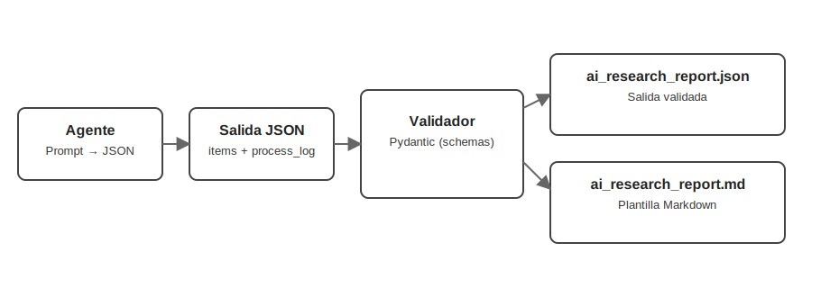

# 🧱 Lección 5: Respuestas estructuradas con esquemas y validación

Resumen: Establece contratos de salida con Pydantic y/o `output_schema`; valida JSON, genera Markdown y coordina con callbacks para trazabilidad.

Notebook de la lección: https://github.com/seagomezar/ADK-Blog-Posts/blob/main/Lesson_5.ipynb

En esta quinta lección llevamos tu agente a un nivel “enterprise”: estandarizamos la salida con esquemas, validamos datos y mantenemos la trazabilidad que iniciamos con los callbacks de la Lección 4. El objetivo es lograr respuestas predecibles, fáciles de consumir por otras apps y listas para producción. 🔒✨

## Panorama general
- Diseñar un esquema de salida para noticias de IA con contexto financiero.
- Forzar formato estructurado (JSON) desde el agente y validar con Pydantic.
- Convertir la salida validada en Markdown y guardarla como artefacto.
- Reusar callbacks para auditar fuentes y enriquecer el reporte.
- Pruebas de punta a punta y cierre limpio del servicio.



## 5.1 ¿Por qué salidas estructuradas? 📦
Las respuestas libres son útiles para conversación, pero difíciles de integrar. Con esquemas:
- Estandarizas el formato (contrato claro entre agentes y servicios).
- Validas datos (tipos, rangos, obligatoriedad).
- Automatizas transformaciones (JSON → Markdown, dashboards, APIs).
- Reduces retrabajo por respuestas ambiguas.

## 5.2 Define el esquema de salida 🧩
Usaremos Pydantic para modelar cada ítem de noticia y el reporte completo.

```python
from typing import List, Optional
from pydantic import BaseModel, AnyHttpUrl, conlist, Field

class NewsItem(BaseModel):
    headline: str = Field(..., min_length=8)
    company: str
    ticker: Optional[str]
    market_data: str  # p.ej. "$123.45 (+1.23%)"
    summary: str
    sources: conlist(AnyHttpUrl, min_items=1)

class ResearchReport(BaseModel):
    title: str
    items: conlist(NewsItem, min_items=3, max_items=10)
    process_log: List[str] = []
```

## 5.3 Haz al agente “schema-aware” 🧠
Tienes dos caminos complementarios:
- Prompting guiado: instruir al LLM para que devuelva un JSON que siga el esquema.
- Validación programática: parsear y validar el JSON con Pydantic; si falla, reintentar o degradar.

### 5.3.1 Opción nativa ADK: `output_schema`
ADK permite forzar una salida estructurada declarando un esquema Pydantic en `LlmAgent.output_schema`.

```python
from google.adk.agents import LlmAgent

class ReportOut(ResearchReport):
    pass

formatter = LlmAgent(
    name="report_formatter",
    model="gemini-2.0-flash",
    instruction="Devuelve EXCLUSIVAMENTE un JSON que cumpla el esquema.",
    input_schema=None,
    output_schema=ReportOut,   # fuerza JSON
    output_key="final_report_json",  # guarda el resultado en session.state
)
```

Importante: cuando `output_schema` está definido, el agente no puede usar herramientas. Usa este agente solo para la etapa de formateo/estandarización.

### 5.3.2 Patrón de dos agentes (herramientas → formateo)
- Agente A (con herramientas): busca, agrega contexto financiero y prepara un borrador JSON/markdown.
- Agente B (con `output_schema` y sin herramientas): recibe el borrador y devuelve JSON válido que cumple el esquema. Usa `output_key` para dejar el resultado en `session.state` y facilitar su consumo posterior.

Plantilla de instrucción (extracto):
```text
Devuelve EXCLUSIVAMENTE un JSON válido con este shape:
{
  "title": "AI Industry News Report",
  "items": [
    {
      "headline": str,
      "company": str,
      "ticker": str|null,
      "market_data": str,
      "summary": str,
      "sources": [url, ...]
    }
  ],
  "process_log": [str, ...]
}
No agregues comentarios ni texto antes/después del JSON.
```

Validación en tiempo de ejecución:
```python
import json
from pydantic import ValidationError

raw = llm_response_text  # salida del agente (JSON puro)
try:
    data = json.loads(raw)
    report = ResearchReport.model_validate(data)
except (json.JSONDecodeError, ValidationError) as e:
    # Estrategia de recuperación: pedir al modelo que repare el JSON
    # o degradar a plantilla Markdown simple
    raise
```

## 5.4 Integra callbacks para trazabilidad 🔍
Reutiliza el after-tool callback de la Lección 4 para llenar `process_log` con dominios fuente y acciones de control. Incluye ese log dentro del JSON validado y también en el Markdown final.

## 5.5 Del JSON validado a Markdown 📄
Genera un artefacto legible a partir del esquema:
```python
def report_to_markdown(report: ResearchReport) -> str:
    parts = [f"# {report.title}", "\n## Top Headlines\n"]
    for i, item in enumerate(report.items, start=1):
        parts.append(
            f"### {i}. {item.headline}\n"
            f"- **Compañía:** {item.company} ({item.ticker or 'N/A'})\n"
            f"- **Mercado:** {item.market_data}\n"
            f"- **Resumen:** {item.summary}\n"
            f"- **Fuentes:** {', '.join(map(str, item.sources))}\n"
        )
    if report.process_log:
        parts.append("\n## Process Log\n" + "\n".join(f"- {e}" for e in report.process_log))
    return "\n".join(parts)
```

Guarda ambos artefactos:
```python
json_path = "ai_research_report.json"
md_path = "ai_research_report.md"

Path(json_path).write_text(report.model_dump_json(indent=2), encoding="utf-8")
save_news_to_markdown(md_path, report_to_markdown(report))
```

## 5.6 Pruebas end‑to‑end 🧪
- Ejecuta la app:
  - Desde carpeta padre: `adk web` y selecciona el agente.
  - O directo: `adk web --port 8000 app5`
- Solicita: “Prepara un reporte de 5 noticias de IA con tickers”.
- Verifica:
  - El agente devuelve JSON válido (sin texto extra).
  - El JSON pasa validación Pydantic sin errores.
  - `ai_research_report.md` incluye titulares, tickers, mercado y `process_log`.
- Cierra procesos al terminar: `pkill -f "adk web"`.

## 5.7 Recuperación ante errores ⚠️
- JSON inválido: pedir al LLM “reparar JSON” con función de auto‑fix o degradar a plantilla Markdown mínima.
- Campos faltantes: asignar por defecto `N/A` o reintentar con un prompt que pida solo los campos faltantes.
- Fuentes vacías: exigir al modelo que incluya al menos una URL por ítem o marcar el ítem como incompleto.


## Recursos
- Output schema (LlmAgent): https://google.github.io/adk-docs/api-reference/python/google-adk.html#google.adk.agents.LlmAgent.output_schema
- Evaluación: https://google.github.io/adk-docs/evaluate/
- Pydantic: https://docs.pydantic.dev/

—
Anterior lección ➜ https://www.sebastian-gomez.com/category/inteligencia-artificial/adk-clase-4-callbacks-y-guardrails-para-agentes-confiables

Siguiente lección ➜ https://www.sebastian-gomez.com/category/inteligencia-artificial/adk-clase-6-de-desarrollo-a-produccion-streaming-memoria-evaluacion-despliegue-y-observabilidad

Descargo de responsabilidad: Este contenido se basa en el curso “Building Live Voice Agents with Google’s ADK!” de DeepLearning.AI (https://learn.deeplearning.ai/courses/building-live-voice-agents-with-googles-adk/lesson/dewdno61/introduction). Este blog busca acercar material de ADK al español.
