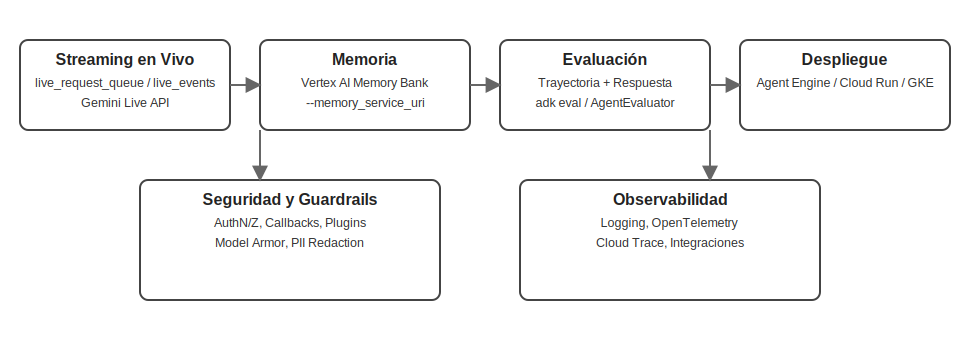

# 🚀 Lección 6: De desarrollo a producción — streaming, memoria, evaluación, despliegue, seguridad y observabilidad

Resumen: Lleva tu agente a producción con streaming en vivo, memoria persistente, evaluación de calidad, despliegue gestionado, guardrails y observabilidad basada en OpenTelemetry.

En esta lección cerramos el círculo: llevamos tu sistema (multi‑)agente del entorno local a producción. Nos apoyamos en el transcript y contrastamos cada pilar con la documentación local de ADK para darte un camino concreto y seguro.

## Panorama general
- Live bidirectional streaming (voz/video) con `Runner.run_live()` y colas de eventos.
- Memoria persistente con Vertex AI Memory Bank (`--memory_service_uri`).
- Evaluación de agentes: trayectorias y respuestas finales (`adk eval`, evaluadores).
- Despliegue: Vertex AI Agent Engine y alternativas (Cloud Run, GKE).
- Seguridad y guardrails: autenticación, callbacks/plugins, Model Armor, redacción PII, código sandbox.
- Observabilidad: logging, métricas y Cloud Trace con OpenTelemetry.



## 6.1 Live Bidirectional Streaming 🎧
ADK separa la lógica del agente del transporte en vivo mediante dos primitivas (docs: `get-started/streaming/` y `streaming/custom-streaming*.md`):
- `live_request_queue`: envía entrada al agente (texto, audio en tiempo real, señales de actividad).
- `live_events`: stream de eventos del agente (respuestas, turnos, interrupciones, tool outputs).

Patrón básico (extracto, ver ejemplos en adk-docs/examples/python/snippets/streaming/adk-streaming):
```python
from google.adk.runners import InMemoryRunner
from google.adk.agents import LiveRequestQueue
from google.adk.agents.run_config import RunConfig
from google.genai import types

# 1) Runner y sesión
runner = InMemoryRunner(app_name="My Streaming App", agent=root_agent)
session = await runner.session_service.create_session(app_name=runner.app_name, user_id="user123")

# 2) Configurar modalidad de respuesta (AUDIO o TEXT)
run_config = RunConfig(response_modalities=["AUDIO"], session_resumption=types.SessionResumptionConfig())

# 3) Wiring live
live_request_queue = LiveRequestQueue()
live_events = runner.run_live(session=session, live_request_queue=live_request_queue, run_config=run_config)

# 4) Cliente → Agente
live_request_queue.send_content(content=types.Content(role="user", parts=[types.Part(text="Hola")]))
# Para audio PCM: live_request_queue.send_realtime(types.Blob(data=pcm_bytes, mime_type="audio/pcm;rate=16000"))

# 5) Agente → Cliente (SSE/WS)
async for event in live_events:
    if event.turn_complete or event.interrupted:
        # avisar cambio de turno/estado
        ...
    elif event.content and event.content.parts:
        part = event.content.parts[0]
        if getattr(part, "inline_data", None) and part.inline_data.mime_type.startswith("audio/pcm"):
            # enviar audio (base64) al cliente
            ...
        elif getattr(part, "text", None):
            # enviar texto incremental/final al cliente
            ...
```

- Modelos: para streaming de voz/video usa modelos con Gemini Live API (docs: `get-started/streaming/quickstart-streaming.md`).
- ADK Web ya usa WebSockets y oculta gran parte de la complejidad. En producción, integra tu propio cliente (FastAPI/WebSocket/SSE) y orquesta `live_request_queue`/`live_events`.

## 6.2 Memoria persistente con Vertex AI Memory Bank 💾
Conecta memoria de largo plazo para personalización entre sesiones (docs: `sessions/memory.md`).

- Arranque con memoria desde CLI (ADK server):
  ```bash
  adk web path/to/agents --memory_service_uri="agentengine://<AGENT_ENGINE_ID>"
  ```
- O configura `VertexAiMemoryBankService` vía SDK si construyes un runner propio.
- Diferencia clave: `session.state` (volátil y de corto plazo) vs Memory Bank (persistente, con extracción/resumen LLM y búsqueda semántica).

## 6.3 Evalúa tu agente: calidad > exactitud 🧪
La evaluación de agentes apunta a calidad y trayectoria, no solo “pass/fail” determinista (docs: `evaluate/index.md`).

- ¿Qué evaluar?
  - Trayectoria y uso de herramientas (orden, precisión, recall, exact match, single-tool checks).
  - Respuesta final (match con referencia; p.ej. ROUGE).
- Formas de evaluar:
  - UI en ADK Web (captura sesiones y convierte a evalset).
  - Programática con `AgentEvaluator` (Python) y/o `pytest`.
  - CLI: `adk eval` sobre uno o más evalsets.

Ejemplo CLI (evalset completo y evals específicos):
```bash
adk eval \
  --project $GOOGLE_CLOUD_PROJECT \
  --region  $GOOGLE_CLOUD_LOCATION \
  path/to/my_evalset.evalset.json

adk eval \
  --project $GOOGLE_CLOUD_PROJECT \
  --region  $GOOGLE_CLOUD_LOCATION \
  path/to/my_evalset.evalset.json:eval_1,eval_2
```

## 6.4 Despliegue a escala 🚀
Tres rutas principales (docs: `deploy/agent-engine.md`, `deploy/cloud-run.md`, `deploy/gke.md`):

- Vertex AI Agent Engine
  - Integración estrecha con ADK; gestiona sesiones, escalado, seguridad, y memoria.
  - CLI (ejemplo con flags útiles):
    ```bash
    adk deploy agent_engine \
      --project=$GOOGLE_CLOUD_PROJECT \
      --region=$GOOGLE_CLOUD_LOCATION \
      --staging_bucket=$STAGING_BUCKET \
      --log_level INFO \
      --trace_to_cloud \
      --allow_origins="https://mi-app.com,https://mi-admin.com" \
      path/to/agent_dir
    ```

- Cloud Run
  - Conteneriza el servicio de tu agente y despliega serverless.
  - CLI (recomendado para Python, con flags útiles):
    ```bash
    adk deploy cloud_run \
      --project=$GOOGLE_CLOUD_PROJECT \
      --region=$GOOGLE_CLOUD_LOCATION \
      --log_level INFO \
      --allow_origins="https://mi-app.com,https://mi-admin.com" \
      --memory_service_uri="agentengine://$AGENT_ENGINE_ID" \
      --trace_to_cloud \
      path/to/agent_dir
    ```

- GKE
  - Control completo con Kubernetes; usa `adk deploy gke` o manifiestos.

Consejos:
- Usa `--trace_to_cloud` para trazas en Cloud Trace en despliegues gestionados.
- Si usas memoria persistente gestionada, pasa `--agent_engine_id`/`--memory_service_uri` según corresponda.

## 6.5 Seguridad y guardrails 🔒
La seguridad es “defense‑in‑depth” (docs: `safety/index.md`).

- Autenticación y autorización
  - Agent‑auth (service accounts) cuando todos comparten privilegios.
  - User‑auth (OAuth) para permisos por usuario; registra atribución de acciones.
- Guardrails con callbacks y plugins
  - Callbacks por agente/herramienta/modelo para filtrar/transformar entradas/salidas.
  - Plugins globales (recomendado en producción) con precedencia y retorno anticipado si devuelven valor.
  - Ejemplos de plugins del docs: “Gemini as a Judge”, “Model Armor”, “PII Redaction”.
- Filtrado de contenido y sanitización
  - Combinación de filtros nativos del modelo (Gemini Safety) + políticas.
  - Sanitiza inputs para mitigar prompt injection (indirecta y directa).
- Ejecución de código sandbox
  - Usa ejecutores seguros (p.ej., Built‑in Code Execution, GKE Code Executor con gVisor) o Vertex Code Interpreter.
- Red y perímetros
  - VPC‑SC, mínimos privilegios, sin redes abiertas en ejecutores de código.

Tip: Para políticas reutilizables, define Plugins y ajústalos con métricas/telemetría. Recuerda que plugins se ejecutan antes que callbacks de nivel agente y pueden detener la cadena si devuelven algo distinto a `None`.

## 6.6 Observabilidad y trazabilidad 📈
Monitorea, depura y optimiza con logging y OpenTelemetry (docs: `observability/logging.md`, `observability/cloud-trace.md`).

- Logging
  - Controla verbosidad desde CLI: `--log_level DEBUG|INFO|...` en `adk web`, `adk api_server`, `adk deploy *`.
  - En desarrollo, habilita DEBUG y revisa prompts/llamados a herramientas.
- Cloud Trace (GCP)
  - En despliegues gestionados añade `--trace_to_cloud`.
  - O integra exportadores OpenTelemetry (Cloud Trace Span Exporter) en runtimes custom.
- Integraciones de terceros
  - Weave (W&B), Arize AX, Phoenix, AgentOps — soportadas y documentadas.

## 6.7 Checklist de producción ✅
- Modelos: elegidos por latencia/capacidades (Live API para voz/video).
- Memoria: `--memory_service_uri=agentengine://<id>` si corresponde.
- Guardrails: Plugins + callbacks; políticas documentadas; sanitización I/O; PII redaction.
- Evaluación: evalsets, criterios y umbrales claros; `adk eval` en CI/CD.
- Observabilidad: `--log_level`, `--trace_to_cloud`, exportadores OTel, dashboards configurados.
- Despliegue: Agent Engine (recomendado) o Cloud Run/GKE con seguridad de red.

## Recursos
- Streaming Quickstart: https://google.github.io/adk-docs/get-started/streaming/quickstart-streaming/
- Memoria: https://google.github.io/adk-docs/sessions/memory/
- Evaluación: https://google.github.io/adk-docs/evaluate/
- Despliegue: https://google.github.io/adk-docs/deploy/agent-engine/, https://google.github.io/adk-docs/deploy/cloud-run/, https://google.github.io/adk-docs/deploy/gke/
- Seguridad: https://google.github.io/adk-docs/safety/
- Observabilidad: https://google.github.io/adk-docs/observability/logging/, https://google.github.io/adk-docs/observability/cloud-trace/

—
Anterior lección ➜ https://www.sebastian-gomez.com/category/inteligencia-artificial/adk-clase-5-respuestas-estructuradas-con-esquemas-y-validacion

Siguiente: Conclusión ➜ https://www.sebastian-gomez.com/category/inteligencia-artificial/adk-conclusion

Descargo de responsabilidad: Este contenido se basa en el curso “Building Live Voice Agents with Google’s ADK!” de DeepLearning.AI (https://learn.deeplearning.ai/courses/building-live-voice-agents-with-googles-adk/lesson/dewdno61/introduction). Este blog busca acercar material de ADK al español.
